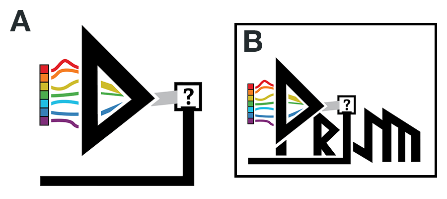

# Summary

Prism uses a combination of statistical methods to conduct spline-based multiple regression. Prism conducts this regression using regularization, dimensionality reduction, and feature selection, through a combination of smoothing spline regression, PCA, and RVR/LASSO. Smoothing splines can be used to model non-parametric relationships using piece-wise cubic functions [@WahbWold1975; @Fox2000]. Relevance vector regression (RVR) refers to application of a relevance vector machine (RVM) to a regression problem; broadly, RVM is similar to multiple linear regression with regularization, using automatic relevance determination for feature selection [@Tipp2000]. RVM shares many commonalities with SVM, and is implemented as a special case of a Sparse Bayesian framework [@Tipp2001; @TippFaul2003].

Prism has been tested in MATLAB 2015b and requires three first-party toolboxes: (1) Curve Fitting Toolbox; (2) Statistics and Machine Learning Toolbox; (3) Signal Processing Toolbox. Relevance vector regression requires the SparseBayes V2 toolbox, which can be obtained from http://www.relevancevector.com.

-

Prism was implemented for conducting multiple regression investigating age-related differences in brain morphology. While linear and quadratic regression are often used (e.g., [@SoweEtal2003; @HogsEtal2013; @MadaKens2016]), it has been shown that non-linear (spline) regression is more appropriate [@FjelEtal2010; @FjelEtal2013].

# References
